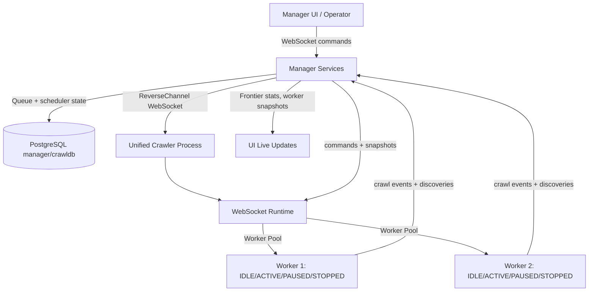

# Webserver Module (Blazor Manager)

## Purpose

The webserver module (Blazor/.NET 10) provides a single reusable manager UI instance for configuration, observability, and control-plane operations over authenticated WebSocket channels.

## Architecture

The manager serves two critical roles:

1. **Frontier/Scheduling Owner**
   - Owns queue lifecycle and scheduling decisions in manager services and DB-backed state.
   - Receives discovered URLs and worker outcomes from connected daemons.
   - Persists observability/ingest records and drives command dispatch.
   
2. **Control Plane** (for daemon/worker operations)
   - Spawns/controls workers with start/pause/stop lifecycle
   - Tracks worker state machine transitions (IDLE → ACTIVE → PAUSED → STOPPED)
   - Receives state change events and metrics from workers
   - All communication over token-authenticated reverse WebSocket channel

## Assignment-Mapped Responsibilities

- Expose websocket daemon controls and daemon configuration from the UI
- Surface crawl statistics, frontier queue state, and worker health metrics
- Surface crawl statistics, including collected binary file type counters (PDF, DOC, DOCX, PPT, PPTX)
- Provide an operator-facing workflow to inspect pages, workers, and graph relationships
- Maintain authenticated WebSocket channels for:
  - Reverse channel: daemon → manager (heartbeat, state changes, snapshots)
  - Request channel: manager → daemon (commands, queue operations)
- Initialize default daemon on startup with 1 worker (for local development)

## Default Daemon Initialization

On webserver startup:

1. Check if local daemon is already running (connect test)
2. If not: spawn `pa1/crawler/src/main.py`
3. Wait for reverse channel connection
4. Spawn 1 initial worker as a baseline (can add more via UI)

This ensures a working crawl environment without manual daemon startup.

## Runtime and UI Options

UI-configurable parameters should cover:
- WebSocket connection/auth parameters for daemon
- Frontier queue behavior, lease timing, and scheduling controls
- Worker lifecycle actions (start/pause/stop/spawn)
- Worker count limits and concurrency settings
- Crawl strategy controls (politeness, robots policy, preferential scoring)
- Refresh/streaming cadence and dashboard filters
- Graph exploration mode selection:
   - Static results graph (database snapshot)
   - Dynamic replay graph (crawler event history timeline)

## Daemon Start Script Generation

- The Worker Global Config page provides a generated daemon start/registration script.
- Script includes websocket registration parameters and runtime command:
- `CRAWLER_DAEMON_ID`
- `MANAGER_DAEMON_WS_URL`
- `MANAGER_HTTP_BASE_URL`
- `MANAGER_DAEMON_WS_TOKEN`
- `MANAGER_INGEST_API_TOKEN`
- `python pa1/crawler/src/main.py`
- Supports bash and docker templates. If no token is configured/provided, UI generates one for the script output.
- Docker template is loopback-aware for local manager URLs:
   - Linux loopback manager: uses `--network host`
   - non-loopback/local translation: uses `--add-host host.docker.internal:host-gateway`

## Worker State Machine Integration

The UI displays live state transitions:

| State | User Action | Auto-Transition | Display |
|-------|------------|-----------------|---------|
| IDLE | start-worker | → ACTIVE on claim | Idle (ready) |
| ACTIVE | pause-worker | (may resume) | Active (processing URL) |
| PAUSED | resume / continue | → ACTIVE or STOPPED | Paused |
| STOPPED | start-worker | → IDLE | Stopped |

All transitions are logged with timestamp and reason.

## Queue Management Features

- **Live frontier stats:** explicit In queue / In memory / Leased counters with completion/failure context
- **Binary type visibility:** Collected Pages shows PDF/DOC/DOCX/PPT/PPTX counters (zero-safe) using collected `BINARY` pages and known type metadata
- **Image type visibility:** Collected Pages shows JPG/PNG/WEBP/GIF/SVG/BMP/TIFF/ICO/AVIF/OTHER counters inferred from collected binary URLs
- **Document payload persistence:** manager ingest accepts optional `binaryContentBase64` for detected document binaries and stores bytes in `crawldb.page_data` when provided.
- **Duplicate detection:** Identify and link duplicate URLs
- **Terminal duplicate handling:** manager-side enqueue upsert keeps `DUPLICATE` rows terminal instead of re-queuing them
- **Lease management:** Automatic requeue on worker timeout/failure
- **Delegate politeness scheduling:** Claim/dequeue skips cooled-down candidates per crawler daemon and resolved site IP, then returns the next valid URL
- **Robots-aware cooldown extension:** worker ingest payloads report observed `robotsCrawlDelaySeconds` / `effectiveDelaySeconds`, and manager extends per-IP cooldowns accordingly
- **Priority visualization:** Show high-priority pending URLs to operators
- **Queue list continuity:** Dashboard queue view refreshes frequently and immediately shows replacement queued URLs after claims
- **Rate-limit observability:** queue rows and dedicated widget surface active IP cooldown windows with mapped domains
- **Stable dashboard layout:** IP timeout diagnostics render in a fixed-height queue header panel to avoid layout jumps
- **Locked-item visibility:** dashboard includes a collapsed `LOCKED` / `PROCESSING` queue snapshot so active locks do not push queued candidates out of view

## Graph Visualization Features

- **Static graph:** Current page/link topology snapshot for results inspection
- **Dedicated site graph view:** Separate renderer aggregates unique visited sites, sizes nodes by page count, colors by score, and labels inter-site edge counts
- **Dynamic replay:** Timeline playback that replays crawler event history over graph growth
- **Replay controls:** Play/pause, reset, speed control, and scrub slider
- **Three-level interaction (topology/replay):** Domain, subdomain, and page exploration via explicit level controls (page-first default)
- **Aggregate edge weights:** Domain/subdomain modes render cross-group links with edge-count labels

## Instance Management Rule

Use one webserver instance and reuse it for local development and operator sessions, instead of creating multiple competing manager instances.

## Complex Visual Work Rule

For complex UI/visual changes, use Playwright-assisted verification flows and reuse an existing browser tab/session where possible.

## Flow (New Unified Architecture)

## Dockerfile Impact

- Single manager Dockerfile (no changes to core responsibility)
- Default daemon initialization timing: manager startup → check for existing daemon → spawn if needed
- Use auth tokens/TLS for inter-process communication (production-grade)
