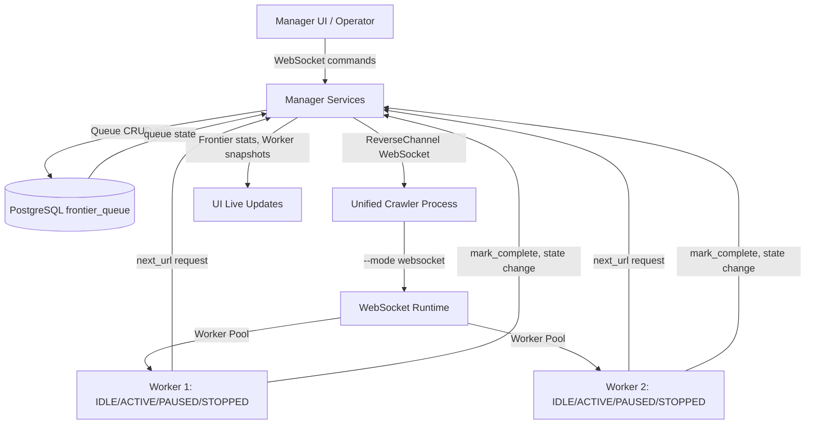

# Webserver Module (Blazor Manager)

## Purpose

The webserver module (Blazor/.NET 10) provides a single reusable manager UI instance for configuration, observability, and control-plane operations over authenticated WebSocket channels.

## Architecture

The manager serves two critical roles:

1. **Frontier Queue Provider** (for WebSocket mode crawlers)
   - Manages the `frontier_queue` PostgreSQL table (states: QUEUED, LOCKED, PROCESSING, COMPLETED, DUPLICATE, FAILED)
   - Implements the `FrontierQueueProvider` protocol for worker queue operations
   - Provides `next_url()`, `mark_complete()`, `mark_failed()`, `mark_duplicate()` via WebSocket
   
2. **Control Plane** (for daemon/worker operations)
   - Spawns/controls workers with start/pause/stop lifecycle
   - Tracks worker state machine transitions (IDLE → ACTIVE → PAUSED → STOPPED)
   - Receives state change events and metrics from workers
   - All communication over token-authenticated reverse WebSocket channel

## Assignment-Mapped Responsibilities

- Expose unified crawler (mode-aware) controls and daemon configuration from the UI
- Surface crawl statistics, frontier queue state, and worker health metrics
- Provide an operator-facing workflow to inspect pages, workers, and graph relationships
- Maintain authenticated WebSocket channels for:
  - Reverse channel: daemon → manager (heartbeat, state changes, snapshots)
  - Request channel: manager → daemon (commands, queue operations)
- Initialize default daemon on startup with 1 worker (for local development)

## Default Daemon Initialization

On webserver startup:

1. Check if local daemon is already running (connect test)
2. If not: spawn `pa1/crawler/src/main.py --mode websocket` (or daemon/main.py)
3. Wait for reverse channel connection
4. Spawn 1 initial worker as a baseline (can add more via UI)

This ensures a working crawl environment without manual daemon startup.

## Runtime and UI Options

UI-configurable parameters should cover:
- WebSocket connection/auth parameters for daemon
- Frontier threshold for queue spillover to DB
- Worker lifecycle actions (start/pause/stop/spawn)
- Worker count limits and concurrency settings
- Crawl strategy controls (politeness, robots policy, preferential scoring)
- Refresh/streaming cadence and dashboard filters

## Worker State Machine Integration

The UI displays live state transitions:

| State | User Action | Auto-Transition | Display |
|-------|------------|-----------------|---------|
| IDLE | start-worker | → ACTIVE on claim | Idle (ready) |
| ACTIVE | pause-worker | (may resume) | Active (processing URL) |
| PAUSED | resume / continue | → ACTIVE or STOPPED | Paused |
| STOPPED | start-worker | → IDLE | Stopped |

All transitions are logged with timestamp and reason.

## Queue Management Features

- **Live frontier stats:** QUEUED count, LOCKED count, COMPLETED/FAILED counts
- **Duplicate detection:** Identify and link duplicate URLs
- **Lease management:** Automatic requeue on worker timeout/failure
- **Priority visualization:** Show high-priority pending URLs to operators

## Instance Management Rule

Use one webserver instance and reuse it for local development and operator sessions, instead of creating multiple competing manager instances.

## Complex Visual Work Rule

For complex UI/visual changes, use Playwright-assisted verification flows and reuse an existing browser tab/session where possible.

## Flow (New Unified Architecture)

## Dockerfile Impact

- Single manager Dockerfile (no changes to core responsibility)
- Default daemon initialization timing: manager startup → check for existing daemon → spawn if needed
- Use auth tokens/TLS for inter-process communication (production-grade)
