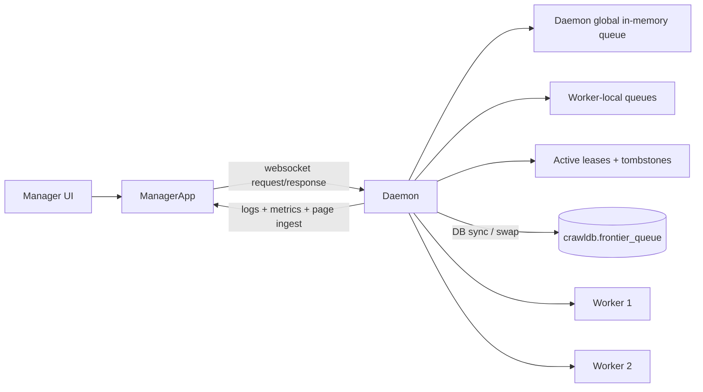
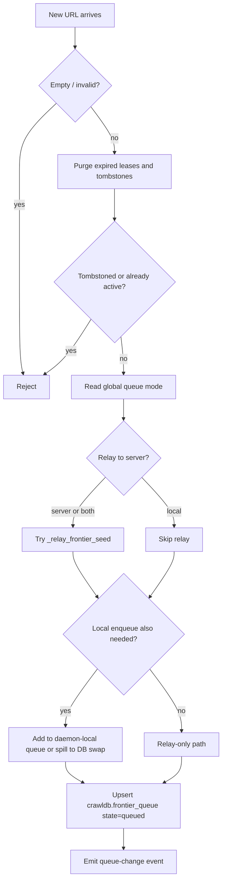
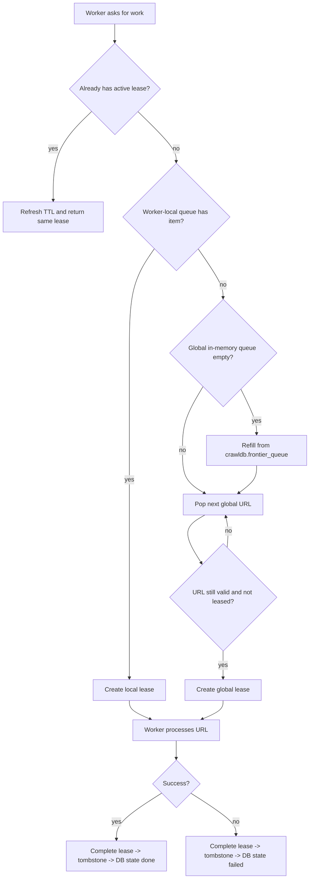
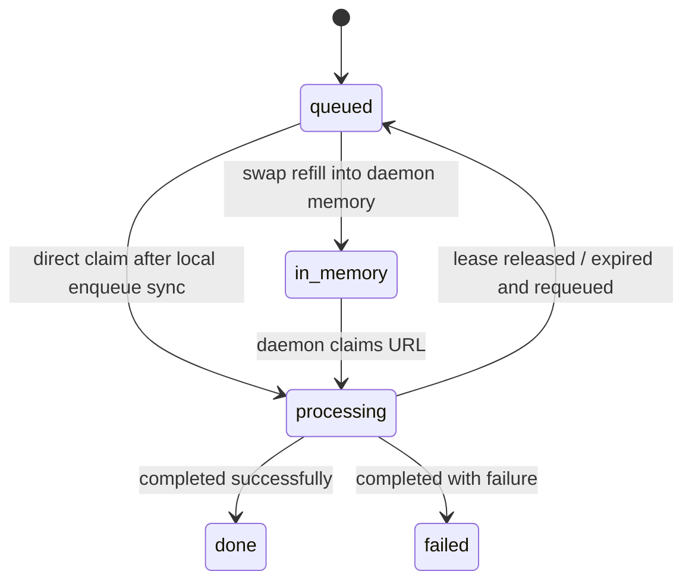
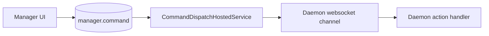

# Queue Implementation

This document explains the queueing model used in this project, with a focus on the live
`ManagerApp -> daemon -> worker` runtime.

It also calls out an important distinction:

- the live runtime frontier is implemented in `pa1/crawler/src/api/worker_service.py`
- a separate priority frontier exists in `pa1/crawler/src/core/frontier.py` for standalone/demo use

Those two are related in intent, but they are not the same runtime path today.

## 1. High-Level Model

The active crawler architecture is:

- `ManagerApp` is the control plane
- the daemon owns the frontier and lease state
- workers ask the daemon for work
- the database is used for persistence, observability, and swap/overflow

## 2. Runtime Queue Structures

The live daemon queue is built from a few cooperating structures inside
`DaemonWorkerService`:

| Structure | Purpose |
|---|---|
| `_frontier_queue: deque[str]` | daemon-global in-memory queue |
| `_known_frontier_urls: set[str]` | dedupe set for the global queue |
| `_worker_local_queues: dict[int, deque[str]]` | worker-targeted local queue |
| `_worker_local_known_urls: dict[int, set[str]]` | dedupe set for each worker-local queue |
| `_frontier_leases: dict[str, FrontierLease]` | current ownership of URLs being processed |
| `_active_claim_by_worker: dict[int, FrontierLease]` | current lease per worker |
| `_completed_tombstones: dict[str, float]` | recently completed/failed URLs that should not be re-added immediately |
| `crawldb.frontier_queue` | persistent swap/log table for overflow and state tracking |

The live runtime queue is therefore:

1. in-memory first
2. lease protected
3. optionally mirrored into Postgres
4. optionally refilled from Postgres when memory is empty

## 3. Enqueue Flow

When a seed URL or discovered link is added, the daemon does not immediately hand it to a
worker. It first goes through dedupe, collision prevention, mode handling, and optional DB sync.

### Collision prevention

Before enqueueing, the daemon rejects a URL if any of these are true:

- it is tombstoned
- it is already in the global queue
- it is currently leased to a worker
- it is already present in any worker-local queue

That check is done by `_is_url_active_any_queue`.

### Worker-targeted enqueue

If the UI adds a seed for a specific worker, the daemon can enqueue it twice:

- once into the daemon-global queue
- once into that worker's local queue

This only happens for `local` or `both` when `add_seed(workerId=...)` is used.

Worker-local queue claims are preferred over global claims.

## 4. Claim, Lease, and Completion Flow

Workers do not pop directly from the queue. They ask the daemon to claim work.

Claim order is:

1. existing active lease for the same worker gets renewed
2. worker-local queue
3. daemon-global queue
4. DB swap refill, but only when the in-memory global queue is empty

### Lease semantics

Each claim produces a `FrontierLease`:

- `url`
- `worker_id`
- `token`
- `expires_at_monotonic`
- `source` (`local` or `global`)

Important behavior:

- a worker can refresh its existing lease instead of getting a second URL
- a lease has a TTL
- on expiry, the URL is requeued at the front of the global queue
- on daemon stop, active claims are released and requeued
- on completion, the URL becomes tombstoned for a while to prevent immediate re-add

### Dequeue batch endpoint

The daemon also supports a batched dequeue path:

- request action / API: `dequeue-frontier`
- implementation: `dequeue_frontier_urls(...)`

It:

- accepts a list of worker IDs
- returns at most one lease per worker in a batch
- caps batch size to `1..100`
- reports `remainingInMemory` and `activeLeases`

This is not a separate queue. It is a batch claim interface over the same frontier state.

## 5. Postgres Frontier Table

The live daemon persists queue state into `crawldb.frontier_queue`.

Schema summary:

- `canonical_url`
- `priority`
- `source_url`
- `depth`
- `state`
- `discovered_at`
- `dequeued_at`

Allowed states:

- `queued`
- `in_memory`
- `processing`
- `done`
- `failed`

### What the table is used for

In the current runtime, `crawldb.frontier_queue` plays two roles:

1. overflow swap storage when the daemon in-memory queue hits `max_frontier_in_memory`
2. state mirror / audit trail for queue lifecycle

### Swap refill behavior

When the in-memory global queue becomes empty, the daemon refills it from Postgres using
`PostgresFrontierSwapStore.dequeue_batch(...)`.

That query:

- selects rows in `state='queued'`
- orders by `priority DESC, discovered_at ASC`
- uses `FOR UPDATE SKIP LOCKED`
- marks selected rows as `in_memory`

This gives safe chunk loading if multiple consumers ever share the same swap table.

## 6. Queue Modes

The config surface exposes three modes:

- `local`
- `server`
- `both`

These are stored in the global worker config as `queueMode`.

### `local`

`local` means the daemon owns the queue locally.

Behavior:

- no relay attempt is made
- URLs are enqueued into daemon memory
- if memory is full and DB sync is enabled, overflow spills to `crawldb.frontier_queue`
- queue state is still mirrored into Postgres when DB sync is enabled

Use this when:

- the daemon should be fully autonomous
- you want the current most direct and predictable runtime path

### `both`

`both` means:

- try to relay to a server-side frontier, if configured
- also enqueue locally

Behavior:

- relay is attempted first
- local enqueue still happens
- if relay fails, local processing still continues
- DB state still mirrors the local queue

Why it is the default:

- it preserves local forward progress
- it is the safest mode while server-side frontier ownership is still incomplete

### `server`

`server` is intended to mean:

- the authoritative frontier is server-side
- the daemon relays seeds instead of owning the queue itself

Current code behavior:

- the daemon calls `_relay_frontier_seed(...)` only if `MANAGER_FRONTIER_INGEST_URL` is set
- if relay fails and `CRAWLER_DAEMON_ALLOW_DB_FALLBACK=true` (default), the daemon falls back to local enqueue
- if relay fails and fallback is disabled, the URL is pruned

In the current standalone manager setup, this matters:

- `MANAGER_FRONTIER_INGEST_URL` is not wired by the local launcher
- there is no active manager-owned frontier endpoint used by the daemon runtime path
- `relayEnabled` is therefore normally `false`

So today, `server` mode is effectively:

- "try server if someone wires it later"
- otherwise fall back to daemon-local queue if fallback is enabled

That makes `server` more of a forward-looking mode than a fully active standalone mode right now.

## 7. Important Reality Check

There are a few things that look more advanced in config than they currently are in the live queue path.

### 7.1 The live runtime is not using the priority frontier

The reusable priority frontier in `core/frontier.py`:

- uses `PreferentialScorer`
- stores `FrontierEntry.priority`
- pops highest score first

The live daemon runtime in `api/worker_service.py` does not use that class.

Instead, it uses:

- `deque[str]` for the global queue
- `deque[str]` for worker-local queues
- FIFO ordering inside those deques

### 7.2 `priority` is persisted, but currently written as `0`

In the live daemon queue path, persisted rows are currently inserted with `priority=0`.

That means:

- the table supports priority ordering
- the standalone/demo frontier uses real priority values
- the manager-controlled live daemon queue does not yet compute or apply those priorities

### 7.3 Strategy and score settings are stored, not actively driving dequeue order

The config contains:

- `strategyMode`
- `scoreFunction`
- `scoreWeightPages`
- `scoreWeightErrors`

These are saved and exposed in the UI, but they are not yet plugged into the live enqueue/dequeue
ordering logic in `DaemonWorkerService`.

### 7.4 Group queue mode exists, but global queue mode is what the live runtime uses

Group settings include `queueMode`, but the actual enqueue path reads `self._global_config.queue_mode`.

So today:

- global queue mode is authoritative at runtime
- group queue mode is configuration/UI state, not active scheduling logic

## 8. How Workers Actually Consume the Queue

The thread worker loop does this:

1. seed the frontier once on startup
2. periodically ask for a claim
3. if no claim exists, set status to `waiting-for-frontier`
4. if a claim exists:
   - set status to `fetching`
   - download the page
   - extract links
   - enqueue discovered links back into the frontier
   - report page data to the manager
   - emit metrics/logs
   - complete the lease as `completed` or `failed`

This means the frontier is self-feeding:

- completed pages discover new URLs
- discovered URLs go back into the queue
- the daemon keeps the dedupe and lease invariants

## 9. Manager vs Daemon Ownership

In the current architecture:

- the manager is not the live frontier owner
- the daemon is the live frontier owner
- the manager talks to the daemon over websocket RPC
- the manager stores logs, metrics, commands, config, and some seed metadata

So if you are reading the code and asking "where is the real queue?", the answer is:

- live frontier ownership: daemon
- queue persistence / swap / lifecycle mirror: `crawldb.frontier_queue`
- seed history/config storage: `manager.seed_url` (not an active scheduling queue)
- command dispatch queue: `manager.command` (separate concern)

## 10. Separate Queue: Command Queue

There is one other queue in the project that is easy to confuse with the frontier:

- `manager.command`

That table is not a URL frontier.

It is the control-plane command queue used for actions like:

- start daemon
- stop daemon
- start worker
- stop worker

Flow:

So there are really two queue families in the project:

- crawl frontier queue: URLs to process
- command queue: control actions to execute

## 11. Summary

The current queue implementation is best described as:

- daemon-owned
- in-memory first
- FIFO in the live runtime
- lease protected
- DB mirrored
- DB overflow backed
- optionally prepared for future server-owned frontier relay

If you want the shortest practical interpretation of the modes today:

- `local`: fully daemon-local frontier
- `both`: daemon-local frontier plus optional relay attempt; safest current mode
- `server`: intended server-owned mode, but currently falls back to local in standalone setup
