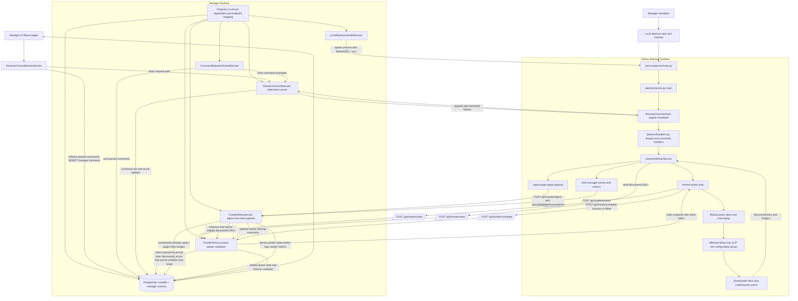

# Full System Workflow Lifecycle (Code-Based)

This document describes the complete crawler lifecycle implemented in this repository, from manager startup to daemon shutdown, and traces each stage to concrete code paths.

## End-to-End Lifecycle Diagram

## Detailed Lifecycle Walkthrough

### 1. Manager bootstraps the runtime

At startup, the manager wires control-plane services, websocket channel, ingest/frontier APIs, and database services in [ManagerApp/Program.cs](ManagerApp/Program.cs#L1).

Important boot wiring:

- Hosted services: [ManagerApp/Program.cs](ManagerApp/Program.cs#L30), [ManagerApp/Program.cs](ManagerApp/Program.cs#L31)
- Daemon websocket endpoint: [ManagerApp/Program.cs](ManagerApp/Program.cs#L61)
- Ingest endpoint: [ManagerApp/Program.cs](ManagerApp/Program.cs#L66)
- Frontier endpoints: [ManagerApp/Program.cs](ManagerApp/Program.cs#L109), [ManagerApp/Program.cs](ManagerApp/Program.cs#L144), [ManagerApp/Program.cs](ManagerApp/Program.cs#L165)

### 2. Manager auto-starts the local daemon process

The local hosted service can auto-start the Python daemon, injecting all manager URLs/tokens via environment variables and forcing manager-owned frontier mode.

- Startup path: [ManagerApp/Services/LocalDaemonHostedService.cs](ManagerApp/Services/LocalDaemonHostedService.cs#L32), [ManagerApp/Services/LocalDaemonHostedService.cs](ManagerApp/Services/LocalDaemonHostedService.cs#L89)
- Process launch and env injection: [ManagerApp/Services/LocalDaemonHostedService.cs](ManagerApp/Services/LocalDaemonHostedService.cs#L131)
- Frontier claim URL injection: [ManagerApp/Services/LocalDaemonHostedService.cs](ManagerApp/Services/LocalDaemonHostedService.cs#L161)
- Local fallback disabled by manager: [ManagerApp/Services/LocalDaemonHostedService.cs](ManagerApp/Services/LocalDaemonHostedService.cs#L164)

### 3. Daemon starts reverse websocket channel and snapshots

Daemon entrypoint in [pa1/crawler/src/main.py](pa1/crawler/src/main.py#L18) delegates to [pa1/crawler/src/daemon/server.py](pa1/crawler/src/daemon/server.py#L14), which creates a reverse websocket client.

- Reverse channel startup: [pa1/crawler/src/daemon/server.py](pa1/crawler/src/daemon/server.py#L17)
- Register snapshot: [pa1/crawler/src/api/reverse_channel.py](pa1/crawler/src/api/reverse_channel.py#L64)
- Heartbeat snapshot every ~4s: [pa1/crawler/src/api/reverse_channel.py](pa1/crawler/src/api/reverse_channel.py#L70), [pa1/crawler/src/api/reverse_channel.py](pa1/crawler/src/api/reverse_channel.py#L71)
- Snapshot payload builder: [pa1/crawler/src/daemon/handlers.py](pa1/crawler/src/daemon/handlers.py#L41)

### 4. Control commands flow from manager to daemon

UI actions use the worker service. It prefers direct websocket requests and can enqueue DB commands for dispatch workflows.

- Manager worker service: [ManagerApp/Services/ReverseChannelWorkerService.cs](ManagerApp/Services/ReverseChannelWorkerService.cs#L1)
- Direct request path: [ManagerApp/Services/ReverseChannelWorkerService.cs](ManagerApp/Services/ReverseChannelWorkerService.cs#L643)
- Command enqueue path: [ManagerApp/Services/ReverseChannelWorkerService.cs](ManagerApp/Services/ReverseChannelWorkerService.cs#L662)
- Dispatcher polling and sending: [ManagerApp/Services/CommandDispatchHostedService.cs](ManagerApp/Services/CommandDispatchHostedService.cs#L25), [ManagerApp/Services/CommandDispatchHostedService.cs](ManagerApp/Services/CommandDispatchHostedService.cs#L134), [ManagerApp/Services/CommandDispatchHostedService.cs](ManagerApp/Services/CommandDispatchHostedService.cs#L154)
- Daemon ack/result status transitions: [ManagerApp/Services/DaemonChannelService.cs](ManagerApp/Services/DaemonChannelService.cs#L369), [ManagerApp/Services/DaemonChannelService.cs](ManagerApp/Services/DaemonChannelService.cs#L376), [ManagerApp/Services/DaemonChannelService.cs](ManagerApp/Services/DaemonChannelService.cs#L454)

### 5. Frontier claim algorithm and leasing

When workers ask for work, frontier claim uses DB-backed priority ordering and lock-safe leasing.

- Claim entry: [ManagerApp/Services/FrontierService.cs](ManagerApp/Services/FrontierService.cs#L306)
- Ordering rule: [ManagerApp/Services/FrontierService.cs](ManagerApp/Services/FrontierService.cs#L330)
- Lock strategy: [ManagerApp/Services/FrontierService.cs](ManagerApp/Services/FrontierService.cs#L332)
- Lease-expiry requeue: [ManagerApp/Services/FrontierService.cs](ManagerApp/Services/FrontierService.cs#L688)
- Completion transition: [ManagerApp/Services/FrontierService.cs](ManagerApp/Services/FrontierService.cs#L449)

### 6. Politeness and robots enforcement

Politeness is enforced at both daemon and manager levels, with a hard 5s floor present in both layers.

- Daemon per-IP limiter default 5s: [pa1/crawler/src/core/politeness.py](pa1/crawler/src/core/politeness.py#L14)
- Daemon wait call: [pa1/crawler/src/core/politeness.py](pa1/crawler/src/core/politeness.py#L20)
- Effective delay composition: [pa1/crawler/src/api/worker_service.py](pa1/crawler/src/api/worker_service.py#L2484)
- Manager minimum cooldown floor: [ManagerApp/Services/FrontierService.cs](ManagerApp/Services/FrontierService.cs#L70), [ManagerApp/Services/FrontierService.cs](ManagerApp/Services/FrontierService.cs#L109)

Robots policy is consulted during crawling and enqueue checks.

- Robots allow decision: [pa1/crawler/src/core/robots.py](pa1/crawler/src/core/robots.py#L26)
- Robots manager fetch/parse: [pa1/crawler/src/core/robots.py](pa1/crawler/src/core/robots.py#L34)
- Current unavailable-policy behavior (allow): [pa1/crawler/src/core/robots.py](pa1/crawler/src/core/robots.py#L28)

### 7. Worker execution loop and concurrency behavior

Workers run a thread loop with adaptive idle wait, claim URLs, fetch/parse, enqueue discoveries, then report result and completion.

- Thread loop start: [pa1/crawler/src/api/worker_service.py](pa1/crawler/src/api/worker_service.py#L1115)
- Adaptive claim pacing: [pa1/crawler/src/api/worker_service.py](pa1/crawler/src/api/worker_service.py#L1131)
- Claim path with manager frontier preference: [pa1/crawler/src/api/worker_service.py](pa1/crawler/src/api/worker_service.py#L1708)
- Download and extraction pipeline: [pa1/crawler/src/api/worker_service.py](pa1/crawler/src/api/worker_service.py#L2338)

### 8. Discovery queueing and manager ingest

Discovered links are first filtered by daemon queue eligibility, then manager ingest performs canonicalization/scope filtering and only queues queue-eligible URLs.

- Daemon enqueue path: [pa1/crawler/src/api/worker_service.py](pa1/crawler/src/api/worker_service.py#L1554)
- Server queue relay decision: [pa1/crawler/src/api/worker_service.py](pa1/crawler/src/api/worker_service.py#L1594)
- Daemon report payload includes queueEligibleDiscoveredUrls: [pa1/crawler/src/api/worker_service.py](pa1/crawler/src/api/worker_service.py#L2548), [pa1/crawler/src/api/worker_service.py](pa1/crawler/src/api/worker_service.py#L2566)
- Manager ingest entry: [ManagerApp/Services/CrawlerRelayService.cs](ManagerApp/Services/CrawlerRelayService.cs#L63)
- Eligibility filtering in ingest: [ManagerApp/Services/CrawlerRelayService.cs](ManagerApp/Services/CrawlerRelayService.cs#L373), [ManagerApp/Services/CrawlerRelayService.cs](ManagerApp/Services/CrawlerRelayService.cs#L412)
- Discovered link upsert: [ManagerApp/Services/CrawlerRelayService.cs](ManagerApp/Services/CrawlerRelayService.cs#L1235)

### 9. Event, log, metric, and snapshot observability

Daemon emits events continuously; manager persists worker state/logs/metrics and keeps live snapshots.

- Event ingest entry: [ManagerApp/Services/CrawlerRelayService.cs](ManagerApp/Services/CrawlerRelayService.cs#L456)
- Daemon channel message processing: [ManagerApp/Services/DaemonChannelService.cs](ManagerApp/Services/DaemonChannelService.cs#L305)
- Register/heartbeat snapshot updates: [ManagerApp/Services/DaemonChannelService.cs](ManagerApp/Services/DaemonChannelService.cs#L326), [ManagerApp/Services/DaemonChannelService.cs](ManagerApp/Services/DaemonChannelService.cs#L403)
- Reverse channel command and request handlers: [pa1/crawler/src/daemon/handlers.py](pa1/crawler/src/daemon/handlers.py#L72), [pa1/crawler/src/daemon/handlers.py](pa1/crawler/src/daemon/handlers.py#L122)

### 10. Shutdown and lifecycle termination

On manager shutdown, the hosted service stops daemon process launchers and optionally issues docker stop command. The daemon also has a parent watchdog based on MANAGER_PARENT_PID.

- Manager shutdown stop path: [ManagerApp/Services/LocalDaemonHostedService.cs](ManagerApp/Services/LocalDaemonHostedService.cs#L70)
- Daemon parent watchdog: [pa1/crawler/src/daemon/server.py](pa1/crawler/src/daemon/server.py#L37), [pa1/crawler/src/daemon/server.py](pa1/crawler/src/daemon/server.py#L38)

## Notes on lifecycle guarantees currently implemented

- Frontier ownership defaults to manager-server mode for global config and default groups.
- Lease claims are deterministic by priority first, then discovery time.
- Cooldown and per-IP politeness enforce a 5-second minimum floor.
- Queueing in manager ingest is constrained by daemon-reported queue eligibility.
- Telemetry is both push-based (events) and pull-based (snapshot heartbeats).
