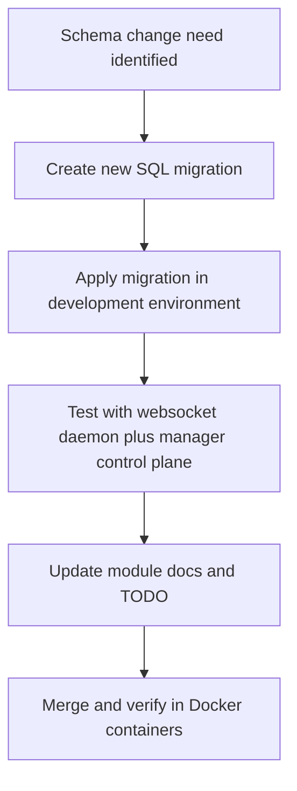

# Database Module

## Purpose

The database module defines and evolves PostgreSQL schema for crawler data, control-plane records, and reporting views.

## Assignment-Mapped Responsibilities

- Store canonical URLs with state tracking and efficient queue operations
- Represent required page types and metadata
- Support duplicate tracking semantics with link edges
- Persist links, images, and page data classifications
- Keep schema aligned with assignment reporting requirements
- Maintain frontier queue with priority-based, state-aware access patterns

## Frontier Queue States (ENUM)

The `frontier_queue_state` enum defines URL processing states:

| State | Meaning | Transitions |
|-------|---------|-------------|
| **QUEUED** | Waiting in queue, not yet acquired | → LOCKED (on claim) |
| **LOCKED** | Acquired by worker, lease active | → PROCESSING, QUEUED (on timeout), FAILED |
| **PROCESSING** | Worker actively processing | → COMPLETED, FAILED, DUPLICATE |
| **COMPLETED** | Successfully processed | (terminal) |
| **DUPLICATE** | Marked as duplicate of another URL | (terminal) |
| **FAILED** | Processing failed | (terminal) |

### Frontier Queue Access Patterns

```sql
-- Get next URL for worker (atomic claim):
SELECT url, priority FROM frontier_queue
WHERE state = 'QUEUED'
ORDER BY priority DESC, discovered_at ASC
LIMIT 1
FOR UPDATE SKIP LOCKED;
-- Then: UPDATE ... SET state = 'LOCKED', locked_at = NOW(), locked_by_worker_id = ?

-- Complete URL:
UPDATE frontier_queue SET state = 'COMPLETED', finished_at = NOW()
WHERE url = ? AND state = 'LOCKED'

-- Mark duplicate:
INSERT INTO crawldb.link(...) VALUES(...)  -- still record the edge
UPDATE frontier_queue SET state = 'DUPLICATE', duplicate_of_url_id = ?, finished_at = NOW()
WHERE url = ? AND (state = 'LOCKED' OR state = 'PROCESSING')

-- Get frontier stats:
SELECT state, COUNT(*) FROM frontier_queue GROUP BY state
```

## Frontier Queue Optimization

**Indexes for Performance:**
- `idx_frontier_queue_priority_heap`: Primary working index, optimized for QUEUED/LOCKED state drilling with priority ordering
- `idx_frontier_queue_duplicate`: Detect/lookup duplicates efficiently
- `idx_frontier_queue_finished`: Track completed/failed counts for reporting
- `idx_frontier_queue_memory_cached`: Flag in-memory vs database-only frontier items
- `idx_frontier_queue_locked_at`: Lease expiration detection for timeout/reassignment

**Current usage note:**
- Crawler-side frontier DB spill/sync paths were removed in websocket-only mode.
- Manager services and DB-backed control-plane components remain the source of truth for persisted queue state.

## Migration Policy

- Structural changes must be introduced through ordered migration SQL files in `db/migrations`
- Migration history should be additive and traceable
- Avoid ad-hoc schema drift outside migration scripts
- Make migrations idempotent using `IF EXISTS` / `IF NOT EXISTS` checks

## Operational Notes

- Database schema is a shared contract across crawler daemon runtime and manager UI/services
- Schema changes should be coordinated with related module docs, Dockerfiles, and TODO updates
- Frontier queue performance is critical: verify indexes and query plans after schema changes

## Flow


