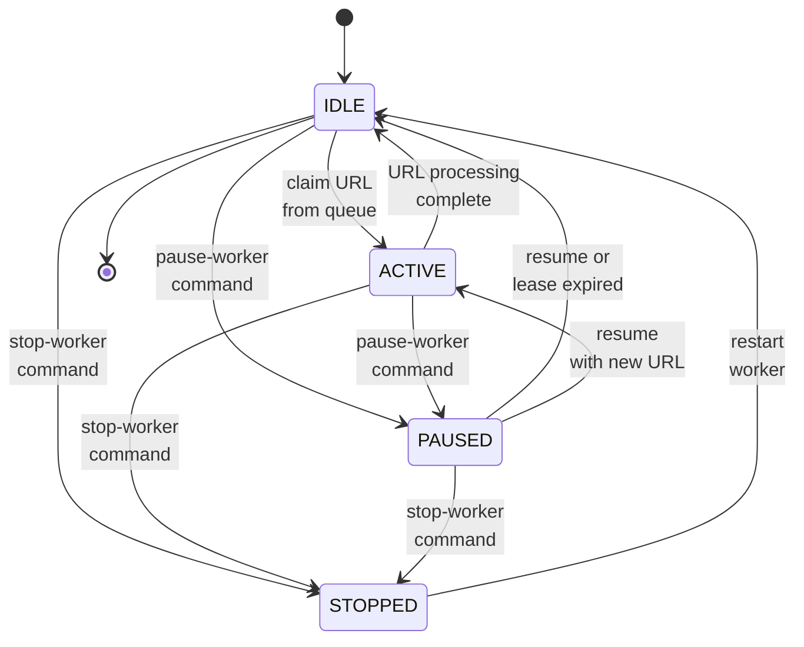

# Daemon Worker Runtime: Startup, Parallelization, and Queue Semantics

This document describes how worker startup and parallelization work in the current daemon implementation, and how URL queue lifecycle behaves after the latest fixes.

## 1. Runtime model

The crawler runs as a single daemon process (`pa1/crawler/src/daemon/main.py`) that can manage multiple workers.

- Instance level: one daemon instance (`single-daemon`)
- Worker level: multiple workers (`multi-worker`)
- Worker execution mode:
  - `thread`: OS thread inside daemon process
  - `local`: separate OS process launched from daemon

Manager communication is daemon-initiated over reverse websocket channel.

## 2. Startup flow (what happens now)

### 2.1 Daemon startup

When daemon starts:

1. `DaemonWorkerService` is created.
2. Worker ID counter is bootstrapped from:
   - in-memory worker IDs
   - persisted max IDs in DB (`manager.worker`, `manager.worker_log`, `manager.worker_metric`, `manager.seed_url`)
3. Reverse channel connects to manager and starts heartbeat/snapshot exchange.
4. Daemon state becomes available to Manager UI.

### 2.2 Worker spawn vs worker start

Worker lifecycle is now explicit:

- `spawn-worker`:
  - creates worker record
  - assigns mode, seed metadata, group membership
  - keeps worker in **Idle** state
  - does **not** start execution immediately

- `start-worker`:
  - validates daemon is running
  - validates max concurrency budget (`maxConcurrentWorkers`)
  - launches worker execution depending on mode:
    - `thread` -> starts thread worker loop
    - `local` -> starts local process

This avoids ambiguous startup behavior and makes control-plane actions deterministic.

### 2.3 Concurrency guard

Before starting a worker, daemon checks currently active/running workers and enforces:

- `active_running < maxConcurrentWorkers`

If the limit is reached, start is rejected and worker remains `Idle` with reason `max-concurrency-reached`.

## 3. Parallelization semantics

Parallelization is worker-based.

- Each active thread worker repeatedly:
  1. claims next frontier lease
  2. downloads + parses one URL
  3. emits metrics/events
  4. completes claim
  5. repeats

- Multiple active workers run the same loop concurrently.
- Thread mode provides in-process parallelism.
- Local mode provides process-level isolation.

Effective parallelism is bounded by `maxConcurrentWorkers`.

## 4. Frontier queue lifecycle

### 4.1 In-memory queue behavior

URL lifecycle inside daemon frontier:

1. `enqueue` -> URL added to queue set/deque
2. `claim` -> URL popped from queue and leased to worker
3. `complete` -> lease removed and URL tombstoned for dedupe TTL

So yes: after a URL is parsed/processed, it is removed from the active queue.

### 4.2 Database queue behavior (important fix)

For `crawldb.frontier_queue`, terminal rows are now removed by default:

- when claim completes with terminal state (`done` / `failed`), row is deleted
- this is controlled by:
  - `CRAWLER_FRONTIER_REMOVE_TERMINAL_ROWS=true` (default)

This keeps `frontier_queue` aligned with "pending/in-flight queue" semantics instead of accumulating completed history rows.

## 5. Queue correctness notes

- Duplicate prevention uses active queue + active leases + local worker queues + tombstones.
- Expired leases are requeued automatically.
- Worker stop/pause/reload can release active lease and optionally requeue.

## 5.5 Worker State Machine

Each worker maintains a discrete state machine that represents its lifecycle:

- **IDLE**: Worker initialized and ready, awaiting item from queue or previous processing to complete
- **ACTIVE**: Worker is actively processing a URL (downloading, parsing)
- **PAUSED**: Worker temporarily paused by operator or system condition; can resume to ACTIVE or transition to STOPPED
- **STOPPED**: Worker terminated; can only restart by transitioning back to IDLE

### State Transitions

All state transitions are validated by the state machine and reported to the server for logging and UI updates.

### Transition Details

| From | To | Trigger | Reason |
|------|-----|---------|--------|
| IDLE | ACTIVE | Worker claims next frontier item | Auto-transition when URL available |
| IDLE | PAUSED | `pause-worker` command | Operator pause request |
| IDLE | STOPPED | `stop-worker` command | Operator stop request |
| ACTIVE | IDLE | URL processing complete | Heartbeat/report after crawl done |
| ACTIVE | PAUSED | `pause-worker` command | Operator pause mid-processing |
| ACTIVE | STOPPED | `stop-worker` command | Operator stop mid-processing |
| PAUSED | IDLE | Lease expiration or operator resume | Auto-transition or resume command |
| PAUSED | ACTIVE | Resume with new URL | Operator resumes processing |
| PAUSED | STOPPED | `stop-worker` command | Operator stop from pause |
| STOPPED | IDLE | `start-worker` command | Operator restart |

### State Reporting

Every state transition is:
1. **Recorded** in `WorkerStateMachine._transitions` (audit trail)
2. **Timestamped** in ISO 8601 format
3. **Reported** to callbacks registered via `register_state_change_callback()`
4. **Transmitted** to server via reverse channel (WebSocket or HTTP)

This ensures full observability into worker lifecycle changes.

## 7. UI behavior connected to this model

- Worker start/stop actions now map cleanly to execution state.
- Collected pages list now live-refreshes periodically.
- Event views now show parsed/structured messages instead of raw JSON blobs.

## 8. Practical validation checklist

1. Start daemon.
2. Spawn 2+ workers in `thread` mode.
3. Start workers and verify at most `maxConcurrentWorkers` run concurrently.
4. Observe frontier stats: in-memory queued decreases as URLs are claimed.
5. Verify processed URLs disappear from `crawldb.frontier_queue` (terminal rows removed).
6. Confirm new pages appear live in Collected Pages table.
