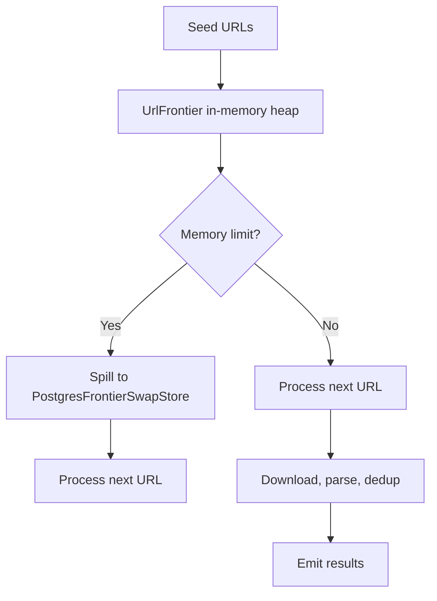
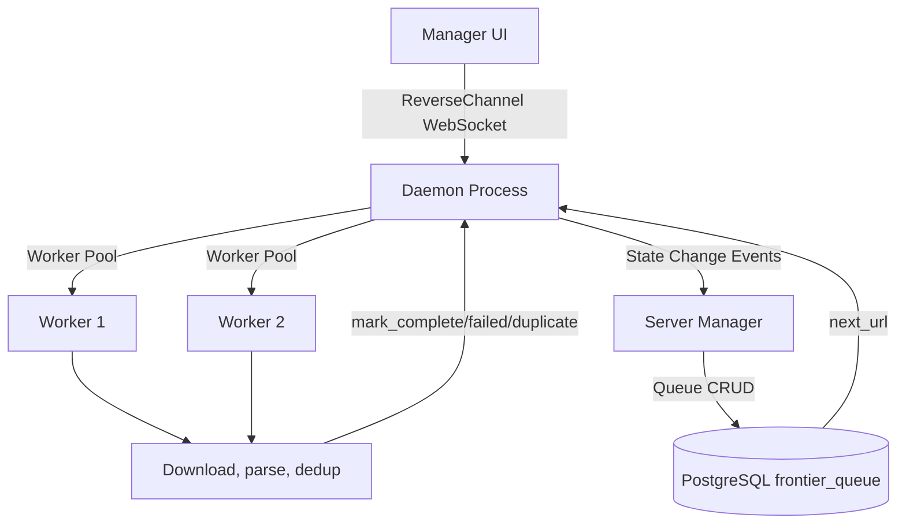
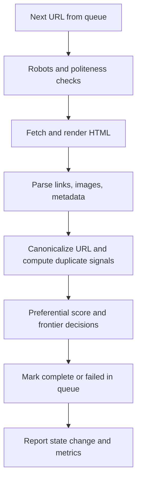

# Crawler Module

## Purpose

The crawler module performs page retrieval and parsing according to PA1 requirements, with preferential URL frontier behavior and duplicate-awareness. It provides a unified entry point supporting two execution modes:
- **Standalone mode**: Direct database access for utilities and one-off crawling
- **WebSocket mode** (daemon): Server-managed queue with token-authenticated communication

## Assignment-Mapped Responsibilities

- Respect robots rules (`User-agent`, `Allow`, `Disallow`, `Crawl-delay`, `Sitemap`).
- Enforce politeness constraints (including host/IP pacing).
- Canonicalize URLs before persistence handoff.
- Parse links from `href` and JavaScript redirect patterns.
- Detect image references from `img[src]`.
- Classify and route content type handling (`HTML`, binary, duplicates/frontier state).
- Apply preferential scoring so relevant URLs are crawled first.

## Unified Entry Point

All crawler execution paths use the unified entry point: `pa1/crawler/src/main.py`

**Mode Selection:**

```bash
# WebSocket mode (default, server-managed queue):
python pa1/crawler/src/main.py
export CRAWLER_MODE=websocket && python pa1/crawler/src/main.py --run-api

# Standalone mode (direct DB, utilities):
python pa1/crawler/src/main.py --mode standalone --canonicalize https://example.com
export CRAWLER_MODE=standalone && python pa1/crawler/src/main.py --ingest-demo
```

**Environment Variable:** `CRAWLER_MODE={standalone,websocket}` (optional, defaults to `websocket`)

**CLI Flag:** `--mode {standalone,websocket}` or `--run-api` (backwards compatibility)

## Mode: WebSocket (Daemon Runtime)

- Crawler connects to manager via token-authenticated WebSocket
- Manager controls URL queue and work distribution
- Worker state machine maintains: IDLE, ACTIVE, PAUSED, STOPPED
- All state transitions reported to manager in real-time
- Queue states: QUEUED, LOCKED, PROCESSING, COMPLETED, DUPLICATE, FAILED

**Typical flow:**
1. Daemon starts (via `daemon/main.py` or `main.py --mode websocket`)
2. Connects reverse channel to manager with auth token
3. Accepts commands: start-worker, pause-worker, stop-worker
4. Manager queries frontier queue; daemon claims next URL for each worker
5. Worker reports completion/failure/duplicate with state change
6. Manager updates UI with live worker metrics

## Mode: Standalone CLI

- Crawler accesses PostgreSQL `frontier_queue` directly
- Useful for one-off utilities and maintenance commands
- No daemon or server communication required

**Available utilities:**
- `--canonicalize URL`: Print canonical form
- `--ingest-demo`: Insert test HTML in crawldb.page
- `--extract-links-demo`: Parse links from HTML
- `--frontier-demo`: Run in-memory frontier prioritization
- `--crawl-once-demo`: Full crawl+parse+extract pipeline
- `--check-url URL`: Validate against robots/politeness
- `--fetch-url URL`: Download URL with optional rendering/binary handling

## Execution Architecture

### Standalone Mode



### WebSocket Mode (Daemon)



## Runtime Options

Typical runtime controls include:
- worker identity and role
- crawl pacing and delays
- frontier dequeue/enqueue sizing
- seeding behavior
- domain/relevance weighting parameters
- daemon relay endpoints and auth tokens (WebSocket mode only)

## Queue Interface (FrontierQueueProvider Protocol)

Workers use a common queue interface regardless of mode:

```python
class FrontierQueueProvider:
    async def next_url(worker_id: int) -> QueuedUrl | None
    async def mark_complete(worker_id, url, lease_token) -> bool
    async def mark_failed(worker_id, url, error, lease_token) -> bool
    async def mark_duplicate(worker_id, url, duplicate_of_url, lease_token) -> bool
    async def add_discovered_urls(discovered: list[FrontierEntry]) -> int
    async def get_frontier_stats() -> dict
```

This abstraction allows:
- **Standalone:** Direct DB implementation (reads from frontier_queue table)
- **WebSocket:** Server implementation (requests via WebSocket)
- Workers remain decoupled from queue concrete implementation

## Notes On Data Access

- **Standalone mode:** Crawler directly accesses PostgreSQL (development/utilities)
- **WebSocket mode:** All DB access through daemon/manager (production)
- Worker business logic (parsing, duplicate detection, preferential scoring) is independent of mode

## Flow (Core Business Logic)



## Compatibility Notes

- `pa1/crawler/src/daemon/main.py` remains as a compatibility wrapper (sets `CRAWLER_MODE=websocket`)
- Old `--run-api` flag still works (deprecated; use `--mode websocket` or default)
- Standalone utilities (_demo commands) accessible via `CRAWLER_MODE=standalone`
