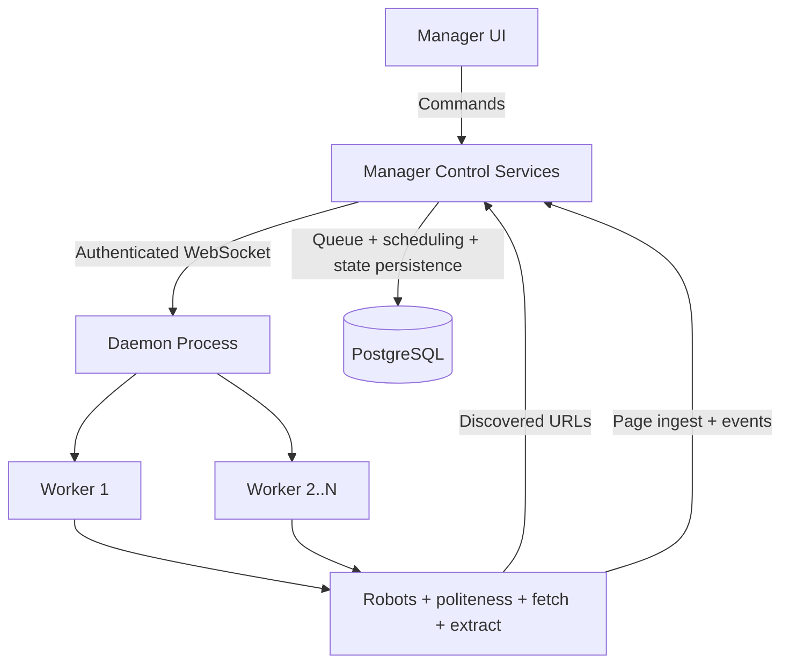
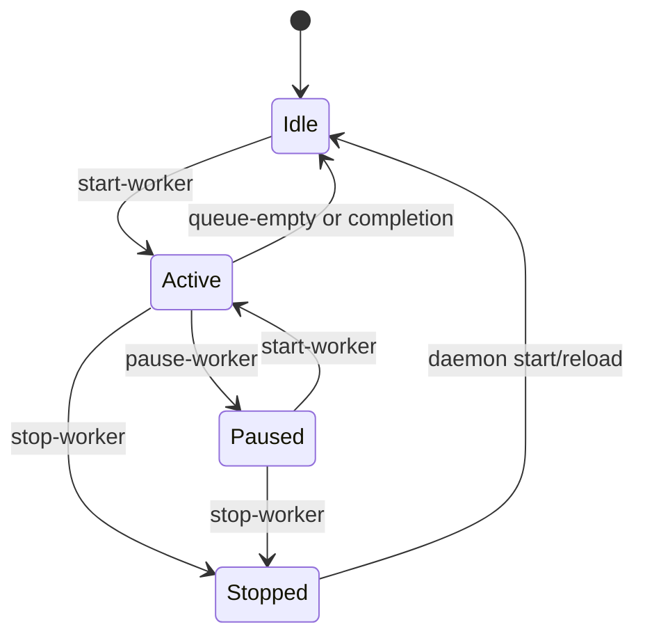
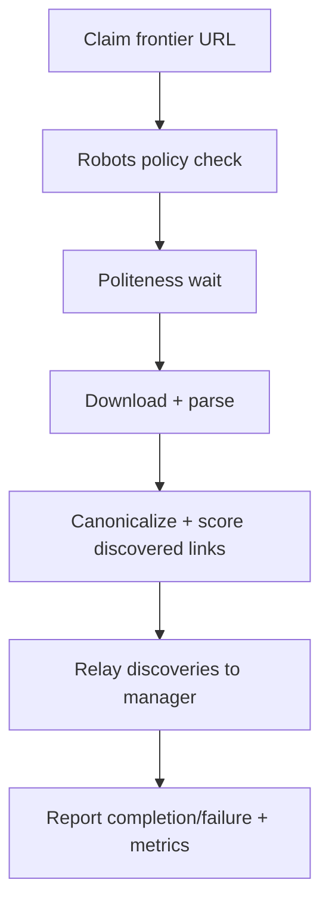

# Crawler Module

## Purpose

The crawler module runs a websocket-controlled daemon that executes worker crawl logic while manager-side services own frontier lifecycle, scheduling decisions, and command orchestration.

## Assignment-Mapped Responsibilities

- Respect robots rules (`User-agent`, `Allow`, `Disallow`, `Crawl-delay`, `Sitemap`).
- Enforce politeness constraints (host/IP pacing and crawl-delay handling).
- Canonicalize URLs before ingest/reporting.
- Parse links from `href` and JavaScript redirect patterns.
- Detect image references from `img[src]`.
- Classify content handling (`HTML`, binary, duplicate handling).
- Apply preferential relevance scoring to discovered URLs.

## Entrypoint

Start the daemon with:

```bash
python pa1/crawler/src/main.py
```

Compatibility flags accepted by the entrypoint:

None.

Standalone mode is removed.

## Runtime Configuration

Common daemon registration environment variables:

- `CRAWLER_DAEMON_ID`
- `MANAGER_DAEMON_WS_URL`
- `MANAGER_DAEMON_WS_TOKEN` (optional)
- `MANAGER_INGEST_API_URL` (optional)
- `MANAGER_EVENT_API_URL` (optional)

Queue behavior options (daemon-side):

- `queue_mode=server` keeps manager as frontier owner.
- Optional local in-memory fallback can be enabled when relay is unavailable.

## Default Crawl Presets

- Default seed preset enables `https://medover.zurnal24.si/` and keeps other starter seeds disabled by default.
- Default relevance keywords include English + Slovenian medical/fitness terms (for example `medicine`, `medicina`, `health`, `zdravje`, `doctor`, `zdravnik`, `hospital`, `bolnisnica`, `fitness`, `fitnes`, `exercise`, `telovadba`, `training`, `trening`, `nutrition`, `prehrana`, `workout`, `vadba`).
- Manager-generated daemon scripts export both `MANAGER_DAEMON_WS_TOKEN` and `MANAGER_INGEST_API_TOKEN` for consistent authenticated relay.
- Worker politeness enforces a hard minimum 5s per-IP delay (`max(5s, configured, robots, group-rate)`), and reported robots/effective delay values are relayed to manager ingest.

## Docker Packaging and Release

- Crawler image is built from `pa1/crawler/Dockerfile`.
- Release target image: `ghcr.io/<owner>/eips-tt-crawler`.
- GitHub workflow `.github/workflows/docker-release.yml` publishes crawler image on `master` and `v*` tags.

## Execution Architecture



## Worker State Semantics



Every transition is emitted as a daemon event for manager observability.

## Crawl Flow



## Notes

- `pa1/crawler/src/daemon/main.py` remains as a compatibility wrapper for existing launch scripts.
- Crawler-side database queue/swap frontier logic has been removed; frontier state is memory + manager relay driven.
