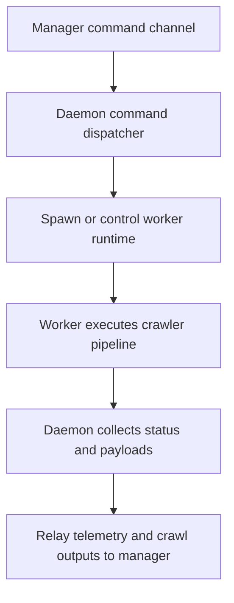

# Daemon Module

## Purpose

The daemon module manages crawler workers, lifecycle commands, and relay channels between workers and manager-side control APIs.

## Assignment-Mapped Responsibilities

- Spawn crawler workers as requested.
- Start/pause/stop/reload workers using control commands.
- Coordinate worker lifecycle telemetry and result forwarding.
- Preserve crawler module boundaries (crawler remains crawl-focused, daemon remains orchestration-focused).

## Runtime Options

Typical controls include:
- daemon identifier
- manager websocket endpoint
- auth token and channel parameters
- max concurrent workers
- heartbeat/reporting cadence
- local worker execution mode configuration

## Worker Spawning Model

- Daemon spawns non-Docker workers in local process/thread execution paths.
- If daemon is containerized, the image must include all code required for those worker spawn paths.

## Entrypoints

- Primary daemon runtime entrypoint: `pa1/crawler/src/daemon/main.py`.
- Runtime loop implementation: `pa1/crawler/src/daemon/server.py`.
- Command/request handler mapping: `pa1/crawler/src/daemon/handlers.py`.

## Flow

